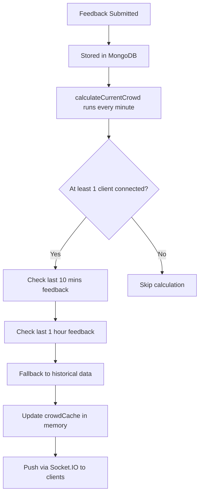

# Puri Temple Crowd Management Backend 🛕📊

A **real-time backend system** for tracking crowd levels at Puri Jagannath Temple gates. Provides APIs for submitting feedback, retrieving live crowd data, and managing historical data per gate and time slot.

Designed for **developers, API users, and recruiters** to understand the structure and functionality.

---

## 📑 Table of Contents

- [Features](#features)
- [Technologies Used](#technologies-used)
- [File Architecture](#file-architecture)
- [Setup & Installation](#setup--installation)
- [Environment Variables](#environment-variables)
- [Database Models](#database-models)
- [API Endpoints](#api-endpoints)
- [Realtime Crowd Updates](#realtime-crowd-updates)
- [Security Features](#security-features)
- [How It Works](#how-it-works)
- [System Workflow Diagram](#system-workflow-diagram)
- [Notes for Recruiters](#notes-for-recruiters)
- [License](#license)

---

## ✅ Features

- 📊 Historical crowd data per gate, day, and 4-hour time slot
- 📝 Real-time feedback system from visitors
- 🧮 Automatic crowd level calculation using:
  - Last 10 minutes of feedback
  - Last 1 hour of feedback
  - Historical data fallback per time slot
- ⚡ Socket.IO integration for live updates
- 🔌 Smart updates: starts only when clients are connected
- 🛑 Auto-stops when no clients are connected
- 🔒 Basic backend security implemented

---

## 🛠️ Technologies Used

| Technology | Purpose |
|------------|---------|
| **Node.js & Express.js** | Backend framework |
| **MongoDB & Mongoose** | Database & ODM |
| **Socket.IO** | Real-time updates |
| **Helmet** | HTTP security headers |
| **express-rate-limit** | API rate limiting |
| **CORS** | Cross-origin configuration |

---

## 📂 File Architecture
```
backend/
│
├── src/
│   ├── config/
│   │   └── db.js                    # MongoDB connection
│   │
│   ├── constants/
│   │   └── gates.js                 # Gate ID definitions
│   │
│   ├── controllers/
│   │   ├── crowd.controller.js      # Crowd data retrieval
│   │   ├── feedback.controller.js   # Feedback submission
│   │   └── historical.controller.js # Historical data upload
│   │
│   ├── models/
│   │   ├── feedback.model.js        # Feedback schema
│   │   ├── historical.model.js      # Historical data schema
│   │   └── gate.model.js            # Gate schema
│   │
│   ├── routes/
│   │   ├── crowd.routes.js          # Crowd endpoints
│   │   ├── feedback.routes.js       # Feedback endpoints
│   │   └── historical.routes.js     # Historical endpoints
│   │
│   └── services/
│       └── crowdCalculator.js       # Crowd logic + live updates
│
├── server.js                         # Main entry (Express + Socket.IO)
├── package.json
├── .env
└── README.md
```

---

## 💻 Setup & Installation

### 1️⃣ Clone the repository
```bash
git clone 
cd backend
```

### 2️⃣ Install dependencies
```bash
npm install
```

### 3️⃣ Create `.env` file
```env
PORT=5000
MONGODB_URI=<your-mongo-db-uri>
```

### 4️⃣ Start the server
```bash
npm run dev
```

🚀 Server will run at `http://localhost:5000`

---

## 🔑 Environment Variables

| Variable | Description | Default |
|----------|-------------|---------|
| `PORT` | Server port | `5000` |
| `MONGODB_URI` | MongoDB connection URI | Required |

---

## 🗄️ Database Models

### 1. **Gate**
```javascript
{
  _id: ObjectId,
  name: String
}
```

### 2. **Historical**
```javascript
{
  gateId: ObjectId,              // Reference to Gate
  dayOfWeek: String,             // "Sunday" → "Saturday"
  timeSlot: String,              // "05-09", "09-13", "13-17", "17-22"
  crowdLevel: String,            // "LOW", "MODERATE", "HIGH", "VERY_HIGH", "EXTREME"
  peopleRange: String            // "0-30", "31-60", "61-90", "91-120", "120+"
}
```

### 3. **Feedback**
```javascript
{
  gateId: ObjectId,              // Reference to Gate
  crowdLevel: String,
  peopleRange: String,
  submittedAt: Date              // Auto-expires after 1 hour
}
```

---

## 🔌 API Endpoints

### 1️⃣ Submit Feedback

**`POST /api/feedback`**

**Request Body:**
```json
{
  "gateId": "697ca74562e6a80637b9cedf",
  "crowdLevel": "HIGH",
  "peopleRange": "61-90"
}
```

**Response:**
```json
{
  "message": "Feedback submitted successfully"
}
```

---

### 2️⃣ Get Current Crowd

**`GET /api/crowd/:gateId`**

**Response:**
```json
{
  "crowdLevel": "MODERATE",
  "peopleRange": "31-60",
  "updatedAt": "2026-01-31T05:20:58.793Z"
}
```

---

### 3️⃣ Upload Historical Data (Bulk)

**`POST /api/historical/bulk`**

**Request Body:** JSON array following Historical schema

---

## ⚡ Realtime Crowd Updates

Socket.IO is used to push real-time updates to clients.

### ✨ Features:
- ✅ Live updates triggered **only when ≥1 client is connected**
- ✅ Stops automatically when no clients are connected

### 🔌 Client Example:
```javascript
const socket = io("http://localhost:5000");

socket.on("connect", () => {
  console.log("Connected to server");
});

socket.on("crowdUpdate", (data) => {
  console.log("Crowd update received:", data);
});
```

---

## 🛡️ Security Features

| Feature | Implementation |
|---------|----------------|
| **HTTP Headers** | `helmet` middleware |
| **Rate Limiting** | `express-rate-limit` |
| **CORS** | Restricted origins (currently `*`) |

---

## 🔍 How It Works


### 📝 Process Flow:

1. **Feedback Submission** → Stored in MongoDB
2. **Crowd Calculation** (runs every minute if ≥1 user connected):
   - ✅ Checks last **10 minutes** of feedback
   - ✅ Checks last **1 hour** of feedback
   - ✅ Falls back to **historical data** for current time slot
3. **Caching** → Crowd data cached in memory (`crowdCache`)
4. **Real-time Push** → Socket.IO broadcasts to connected clients

---

## 🖼️ System Workflow Diagram
```
              ┌────────────────┐
              │   Client App   │
              │  (Web/Mobile)  │
              └───────┬────────┘
                      │
            Socket.IO │ REST API
                      ▼
             ┌──────────────────┐
             │  Express Server  │
             │   (server.js)    │
             └────────┬─────────┘
                      │
          ┌───────────┴───────────┐
          ▼                       ▼
┌──────────────────┐    ┌──────────────────┐
│ Crowd Calculator │    │ Feedback Routes  │
│ (calculateCurrent│    │  POST /feedback  │
│     Crowd)       │    └──────────────────┘
└─────────┬────────┘              │
          │                       │
          ▼                       ▼
   ┌─────────────┐      ┌──────────────────┐
   │ crowdCache  │      │ MongoDB Database │
   │    (RAM)    │      │   - Historical   │
   └──────┬──────┘      │   - Feedback     │
          │             │   - Gate         │
          └────────────>└──────────────────┘
                                 │
                                 ▼
                    Real-time updates via
                    Socket.IO to all clients
```

---

## 📌 Notes for Recruiters

✅ **Clean MVC architecture** for scalability  
✅ **Real-time data** using Socket.IO + in-memory caching  
✅ **Dynamic crowd calculation** with time-slot awareness  
✅ **Security basics** implemented (can be enhanced for production)  
✅ **Fully functional** backend for crowd monitoring systems  

---

## 📄 License

**MIT License** - Feel free to use and modify this project.

---

<div align="center">

**Made with ❤️ for Puri Jagannath Temple** 🛕

</div>