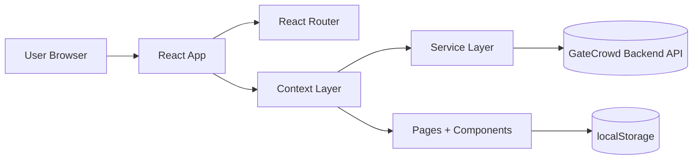
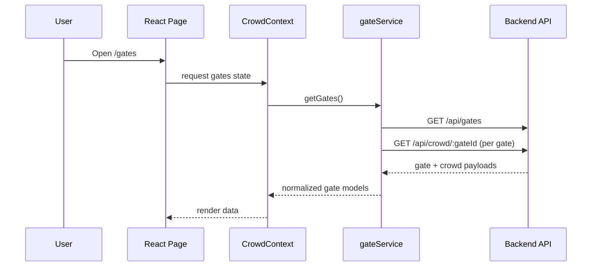
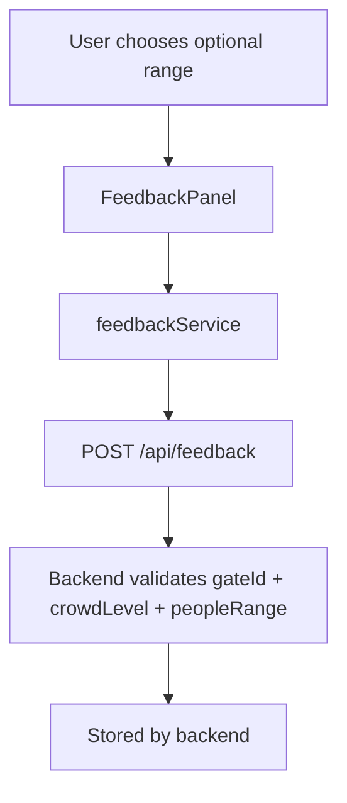

# GateCrowd Frontend

Production-ready React frontend for **GateCrowd**, a real-time crowd monitoring and visitor guidance platform for Puri Jagannath Temple.

This README is for the **frontend only**.

---

## 1. Project Overview

GateCrowd frontend helps visitors:
- View gate-wise live crowd levels
- Compare entry options
- See alerts and recommendations
- Submit optional crowd feedback
- Track crowd trends over time

It is designed for a backend-connected, real-time-ready architecture.

---

## 2. Tech Stack

- React 18 (Functional Components + Hooks)
- Vite 5
- React Router DOM v6
- Bootstrap 5 + custom CSS
- Three.js (3D background layer)
- LocalStorage for client-side persistence

---

## 3. Clone and Run

### Prerequisites

- Node.js 18+
- npm 9+

### Steps

```bash
git clone <your-repo-url>
cd gatecrowd/frontend
npm install
npm run dev
```

Open: `http://localhost:5173`

### Production Build

```bash
npm run build
npm run preview
```

---

## 4. Environment and Backend

Current frontend is wired to this backend base URL:

`https://gatecrowd-backend.onrender.com`

Used endpoints:
- `GET /api/gates`
- `GET /api/crowd/:gateId`
- `POST /api/feedback`

---

## 5. Frontend Architecture

### High-Level Block Diagram



### Application Flow



### Layer Responsibilities

- **Pages**: route-level UI composition
- **Components**: reusable presentation blocks
- **Context**: global state and refresh cycle
- **Services**: backend calls + response normalization
- **Hooks**: focused behavior (theme, simulation/polling, local storage)

---

## 6. Folder Structure

```text
frontend/
├── src/
│   ├── assets/
│   │   ├── images/
│   │   └── icons/
│   ├── components/
│   │   ├── layout/
│   │   │   ├── Navbar.jsx
│   │   │   └── Footer.jsx
│   │   ├── common/
│   │   │   ├── Badge.jsx
│   │   │   ├── CrowdHeatIndicator.jsx
│   │   │   ├── LoadingSpinner.jsx
│   │   │   ├── SkeletonCard.jsx
│   │   │   └── ThreeBackground.jsx
│   │   └── gates/
│   │       ├── CrowdChart.jsx
│   │       ├── FeedbackPanel.jsx
│   │       └── GateCard.jsx
│   ├── context/
│   │   ├── CrowdContext.js
│   │   └── ThemeContext.js
│   ├── hooks/
│   │   ├── useCrowdSimulation.js
│   │   ├── useLocalStorage.js
│   │   └── useTheme.js
│   ├── pages/
│   │   ├── About.jsx
│   │   ├── Alerts.jsx
│   │   ├── GateDetails.jsx
│   │   ├── Gates.jsx
│   │   └── Home.jsx
│   ├── services/
│   │   ├── alertService.js
│   │   ├── feedbackService.js
│   │   ├── gateService.js
│   │   └── socketService.js
│   ├── App.jsx
│   ├── main.jsx
│   └── styles.css
├── index.html
├── package.json
└── vite.config.js
```

---

## 7. Routing

```text
/home
/gates
/gates/:id
/alerts
/about
```

Routing is configured in `src/App.jsx` using React Router DOM v6.

---

## 8. Data Model (Frontend Normalized)

`gateService` transforms backend payloads into a UI-friendly model:

```js
{
  id,
  name,
  description,
  detail,
  direction,
  busyHours,
  importance,
  image,
  crowdLevel,
  crowdLabel,
  peopleRange
}
```

This keeps UI components stable even if backend schema evolves.

---

## 9. State Management

### ThemeContext

- Manages light/dark theme
- Persists selected theme in localStorage

### CrowdContext

- Fetches and stores gates globally
- Polls backend periodically for updates
- Computes best gate by lowest current crowd

---

## 10. Live Features

- **Live gate crowd values** via backend crowd endpoint
- **Trading-style people-range graph** in Gate Details
- **Optional feedback** with cooldown enforcement
- **Offline banner** using `navigator.onLine`
- **3D background layer** with Three.js

---

## 11. Feedback Pipeline



Mapping used on frontend:
- LOW -> `0-30`
- MODERATE -> `31-60`
- HIGH -> `61-90`
- VERY_HIGH -> `91-120`
- EXTREME -> `120+`

---

## 12. Visitor Tracking (Frontend)

About page tracks:
- **Visitors Till Now**: increments once on first visit in that browser
- **Current Site Visitors**: active tab/session presence tracking using localStorage heartbeat
- **Live Temple Footfall**: derived from real backend crowd data loaded for gates

---

## 13. UI/UX Notes

- Mobile drawer navigation slides from right
- Accessible color-coded badges and feedback controls
- Responsive cards and layout across mobile/desktop
- Soft glassmorphism and spiritual saffron/gold visual tone

---

## 14. Scripts

```bash
npm run dev      # start development server
npm run build    # production build
npm run preview  # preview production build
```

---

## 15. Deployment Notes

- Build artifacts output to `dist/`
- Ensure backend CORS includes deployed frontend origin in production
- Keep backend base URL aligned in `src/services/gateService.js`

---

## 16. Known Considerations

- Three.js increases bundle size; consider lazy-loading for further optimization.
- Current site visitor count is frontend-presence based, not server-authoritative analytics.

---

## 17. License

Add your preferred license in the repository root, for example MIT.
